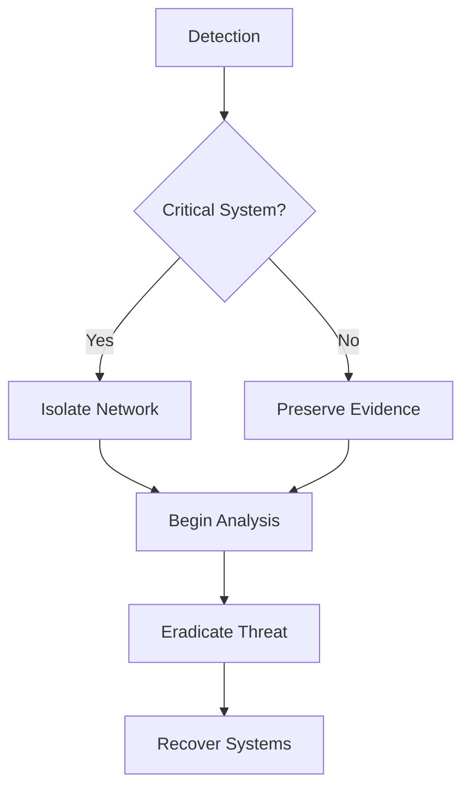

<p align="center">
  
  
  
  
  
  
</p>

# ⚒️ Solomon's Playbook Forge

**IR runbook builder with visual flowcharts, SOAR execution engine, and AI playbook generation.**

Playbook Forge transforms incident response playbooks from Markdown and Mermaid syntax into interactive flowchart visualizations with a full execution engine. SOC teams can build, execute, and track playbook runs step-by-step. AI generation creates playbooks from natural language prompts. SOAR integrations connect to real response platforms.


---

## Features

- **Markdown to Flowchart** - Parse structured Markdown playbooks into node-edge graphs
- **Mermaid Syntax** - Native support for Mermaid flowchart syntax
- **Interactive Canvas** - Drag, pan, zoom with React Flow
- **Custom Node Types** - Phase, Step, Decision, Execute, Merge with 5 variant styles
- **Playbook Library** - Browse, categorize, and filter by type (Vulnerability, Incident Response, Threat Hunting)
- **Execution Engine** - Run playbooks step-by-step with live status tracking, timestamps, and execution history
- **AI Playbook Generation** - Generate complete playbooks from natural language incident descriptions
- **SOAR Integration** - Built-in action library with connections to real response platforms
- **MCP Integration** - Model Context Protocol hooks for AI-assisted execution
- **MiniMap & Controls** - Bird's-eye view and viewport navigation
- **Client-Side Parsing** - Zero-latency Markdown rendering in browser
- **5 Visual Themes** - SOC, Analyst, Terminal, Command, Cyber variants
- **Guided Tour** - Interactive walkthrough for first-time users
- **Offline-First** - No backend required for visualization

---

## Quick Start

```bash
# Clone and install
git clone https://github.com/solomonneas/playbook-forge.git
cd playbook-forge

# Frontend
cd web && npm install && npm run dev

# Backend (optional, for playbook generation AI)
cd ../api && pip install -r requirements.txt && python main.py
```

Frontend: **http://localhost:5177**
Backend: **http://localhost:8000** (optional)

---

## Tech Stack

| Layer | Technology | Purpose |
|-------|-----------|---------|
| **Frontend** | React 18 | Interactive dashboards |
| **Language** | TypeScript 5 | Type safety |
| **Styling** | Tailwind CSS 3 | Utility-first CSS |
| **Canvas** | React Flow 11 | Node-edge graph visualization |
| **State** | Zustand | Global state management |
| **Bundler** | Vite 5 | Dev server and build |
| **Backend** (Optional) | FastAPI | Playbook generation and storage |
| **Parser** | Custom Markdown Parser | Inline playbook parsing |

---

## Playbook Syntax

### Markdown Format

```markdown
# Incident Response: Ransomware Attack

## Phase: Detection
- Step: Identify affected systems
  - Check EDR alerts
  - Correlate with SIEM events
  - Document initial indicators

## Phase: Analysis
- Decision: Is it a critical system?
  - YES -> Execute: Isolate from network
  - NO -> Execute: Begin forensic collection

## Phase: Containment
- Step: Isolate affected hosts
  - Segment network access
  - Disable user accounts
  - Preserve evidence

## Phase: Eradication
- Step: Remove malware
  - Scan with multiple AV engines
  - Remove registry keys
  - Patch vulnerabilities

## Phase: Recovery
- Step: Restore systems
  - Restore from clean backups
  - Apply security patches
  - Re-enable user access
```

### Mermaid Format



---

## Node Types

| Type | Purpose | Example |
|------|---------|---------|
| **Phase** | Major incident response phase | Detection, Analysis, Containment |
| **Step** | Procedural action | Execute EDR scan, Document findings |
| **Decision** | Conditional branch (Yes/No) | Is it critical? Is malware present? |
| **Execute** | SOAR action or tool integration | Isolate host, Disable account, Block IP |
| **Merge** | Convergence point | Rejoining analysis paths |

---

## 5 Variants

| Variant | Theme | Use Case |
|---------|-------|----------|
| **SOC** | Dark slate, red accents | Security operations center |
| **Analyst** | Clean white, blue | Professional analysis |
| **Terminal** | Black, matrix green | Technical incident response |
| **Command** | OD green, amber | Military-style operations |
| **Cyber** | Neon cyan/magenta | Cyberpunk aesthetic |

All variants use the same parsing engine and React Flow canvas. Switch themes instantly.

---

## Project Structure

```text
playbook-forge/
├── web/                      # React frontend
│   ├── src/
│   │   ├── components/
│   │   │   ├── Canvas.tsx       # React Flow canvas
│   │   │   ├── NodeEditor.tsx   # Custom node properties panel
│   │   │   ├── PlaybookLibrary.tsx
│   │   │   └── ...
│   │   ├── pages/
│   │   │   ├── Editor.tsx       # Main editing interface
│   │   │   ├── Library.tsx      # Playbook browser
│   │   │   └── Settings.tsx
│   │   ├── parsers/
│   │   │   ├── markdownParser.ts  # Markdown to graph converter
│   │   │   ├── mermaidParser.ts   # Mermaid parser
│   │   │   └── validator.ts
│   │   ├── store/
│   │   │   └── usePlaybookStore.ts # Zustand (persisted)
│   │   └── variants/            # 5 theme layouts
│   ├── package.json
│   └── vite.config.ts
├── api/                      # FastAPI backend (optional)
│   ├── main.py               # Entry point
│   ├── playbooks/            # Playbook storage
│   ├── generator/            # AI-powered generation
│   └── requirements.txt
└── README.md
```

---

## SOAR Actions

Built-in action library for common SOAR platforms:

**Incident Response Actions:**
- `isolate_host` - Remove host from network
- `disable_account` - Disable user account
- `block_ioc` - Block IP/domain/hash
- `snapshot_vm` - Create VM snapshot
- `quarantine_email` - Isolate email message

**Reconnaissance:**
- `whois_lookup` - IP/domain registration info
- `virustotal_check` - File hash reputation
- `shodan_search` - Internet scan results

All actions are templates that teams can customize.

---

## License

MIT - see [LICENSE](LICENSE) for details.
