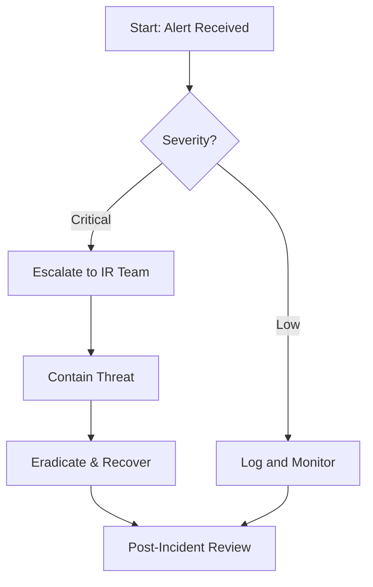

<div align="center">

# ⚒️ Playbook Forge

**Incident response playbook builder with interactive flowchart visualization**

[](https://reactjs.org/)
[](https://www.typescriptlang.org/)
[](https://python.org/)
[](https://fastapi.tiangolo.com/)
[](https://reactflow.dev/)
[](https://tailwindcss.com/)
[](https://vitejs.dev/)
[](LICENSE)

Transform Markdown and Mermaid playbooks into interactive, visual flowchart diagrams.  
Built for SOC teams, incident responders, and security operations professionals.


</div>

---

## ✨ Features

- **Markdown → Flowchart** — Parse structured Markdown playbooks into interactive node-edge graphs
- **Mermaid → Flowchart** — Convert Mermaid flowchart syntax to visual IR diagrams
- **5 Unique UI Variants** — Each with distinct visual themes, layouts, and custom node designs
- **Custom Node Types** — Phase, Step, Decision, Execute, and Merge nodes with variant-specific styling
- **Playbook Library** — Browse, categorize, and filter playbooks by type (vulnerability remediation, IR, threat hunting, etc.)
- **Import & Parse** — Paste or upload Markdown playbooks for instant visualization
- **Interactive Canvas** — Drag, pan, zoom, and explore flowcharts with React Flow
- **MiniMap & Controls** — Bird's-eye view and zoom controls on every flowchart
- **Client-Side Parsing** — Zero-latency Markdown parsing directly in the browser
- **In-App Documentation** — Built-in help pages covering playbook formats, node types, and IR methodology
- **Guided Onboarding Tour** — Interactive walkthrough for first-time users via driver.js

## 🏗️ Architecture

```
┌─────────────────────────────────────────────────────┐
│                   React Frontend                     │
│  ┌──────────┐  ┌───────────┐  ┌──────────────────┐ │
│  │ Variant  │  │ Markdown  │  │  ReactFlow       │ │
│  │ Layouts  │  │ Parser    │  │  FlowCanvas      │ │
│  │ (V1–V5)  │  │ (client)  │  │  Custom Nodes    │ │
│  └──────────┘  └───────────┘  └──────────────────┘ │
│         │             │                │             │
│         └─────────────┴────────────────┘             │
│                       │                              │
│              Hash Router (custom)                    │
└───────────────────────┬─────────────────────────────┘
                        │ REST API
┌───────────────────────┴─────────────────────────────┐
│                  FastAPI Backend                      │
│  ┌──────────────┐  ┌────────────────────────────┐   │
│  │ Markdown     │  │ Mermaid                    │   │
│  │ Parser       │  │ Parser                     │   │
│  └──────────────┘  └────────────────────────────┘   │
│                  Pydantic Models                     │
└─────────────────────────────────────────────────────┘
```

## 🚀 Quick Start

### Prerequisites

- Python 3.9+
- Node.js 16+
- npm

### Backend

```bash
cd playbook-forge
pip install -r requirements.txt
uvicorn api.main:app --reload --host 0.0.0.0 --port 8000
```

API available at `http://localhost:8000` · Swagger docs at `http://localhost:8000/docs`

### Frontend

```bash
cd web
npm install
npm run dev
```

App available at `http://localhost:5173`

### With Make

```bash
make install   # Install all dependencies
make dev-api   # Start backend (terminal 1)
make dev-web   # Start frontend (terminal 2)
```

## 🛠️ Tech Stack

| Layer | Technology | Purpose |
|-------|-----------|---------|
| **Frontend** | React 18 | Component-based UI |
| **Language** | TypeScript 5.3 | Type safety |
| **Flowcharts** | react-flow-renderer | Interactive node-edge graphs |
| **Styling** | Tailwind CSS 3.4 | Utility-first CSS |
| **Bundler** | Vite 5 | Fast dev server & builds |
| **Backend** | FastAPI 0.109 | REST API framework |
| **Validation** | Pydantic 2.5 | Data models & validation |
| **Parsing** | python-markdown | Markdown processing |
| **Server** | Uvicorn | ASGI server |

## 📁 Project Structure

```
playbook-forge/
├── api/                          # FastAPI backend
│   ├── main.py                   # App entry point, CORS, routes
│   ├── models.py                 # Pydantic data models
│   ├── parsers/                  # Markdown & Mermaid parsers
│   ├── routers/                  # API route handlers
│   └── tests/                    # Backend test suite
├── web/                          # React frontend
│   ├── index.html                # Entry HTML
│   ├── package.json
│   ├── src/
│   │   ├── App.tsx               # Root component + routing
│   │   ├── router/               # Custom hash-based router
│   │   │   ├── routes.ts         # Route definitions & matching
│   │   │   └── useHashRouter.ts  # React hook for hash routing
│   │   ├── components/           # Shared components
│   │   │   ├── FlowCanvas.tsx    # ReactFlow canvas wrapper
│   │   │   ├── GuidedTour.tsx    # driver.js onboarding tour
│   │   │   └── nodes/            # Base node types (Phase, Step, Decision, ...)
│   │   ├── pages/                # Shared pages
│   │   │   ├── VariantPicker.tsx # Landing page (variant selector)
│   │   │   ├── DocsPage.tsx      # In-app documentation
│   │   │   └── DocsPage.css
│   │   ├── variants/             # 5 UI variants
│   │   │   ├── v1/               # Technical Manual / Field Guide
│   │   │   ├── v2/               # Dark SOC Operator / Mission Control
│   │   │   ├── v3/               # Clean Documentation / Knowledge Base
│   │   │   ├── v4/               # Interactive Blueprint / Engineering Schematic
│   │   │   └── v5/               # Minimal Academic / Research Paper
│   │   ├── data/                 # Template playbooks & sample data
│   │   ├── hooks/                # Custom React hooks
│   │   ├── parsers/              # Client-side Markdown parser
│   │   ├── lib/                  # API client
│   │   └── types/                # TypeScript type definitions
│   └── vite.config.ts
├── requirements.txt              # Python dependencies
├── Makefile                      # Dev commands
└── README.md
```

## 🎨 5 UI Variants

Each variant provides a complete, themed experience with its own layout, CSS, custom node components, and page implementations:

| Variant | Theme | Description |
|---------|-------|-------------|
| **V1** — Classic | Technical Manual / Field Guide | Military field manual aesthetic with classification banners, sidebar TOC, section numbering, Courier Prime typewriter font |
| **V2** — Command Center | Dark SOC Operator | Deep navy base, electric cyan accents, persistent status bar with live metrics, compact sidebar, JetBrains Mono |
| **V3** — Notebook | Clean Documentation | GitBook/Notion-inspired with expandable sidebar, breadcrumbs, Literata serif for reading, Inter for UI |
| **V4** — Blueprint | Engineering Schematic | Blueprint blue backgrounds, CSS grid overlay, tick-mark drawing border, title block, IBM Plex Mono |
| **V5** — Minimal | Academic Research Paper | Pure white, centered 720px column, Crimson Pro serif, Fraunces headings, printable, no decorations |

Navigate between variants from the landing page at `#/`.

## 📄 Playbook Formats

### Markdown

Playbooks are structured Markdown documents with hierarchical headings that map to flowchart nodes:

```markdown
# Vulnerability Remediation: Python

## Phase 1: Identification
### Step 1.1: Scan Dependencies
Run `pip audit` to identify known vulnerabilities.

### Step 1.2: Review CVE Database
Cross-reference findings with NVD/MITRE.

## Phase 2: Assessment
### Decision: Severity Check
- **Critical/High** → Immediate patching
- **Medium/Low** → Schedule for next sprint

## Phase 3: Remediation
### Execute: Apply Patches
Update affected packages and run regression tests.
```

**Heading → Node Type Mapping:**

| Markdown Pattern | Node Type | Description |
|-----------------|-----------|-------------|
| `# Title` | — | Playbook title / metadata |
| `## Phase N: ...` | Phase | Major IR phase grouping |
| `### Step N.N: ...` | Step | Individual action step |
| `### Decision: ...` | Decision | Branch point with conditions |
| `### Execute: ...` | Execute | Automated/manual execution task |

### Mermaid

Mermaid flowchart syntax is also supported for direct graph definitions:



## 📋 Pages Per Variant

Each variant includes four pages accessible via hash routing:

| Route | Page | Description |
|-------|------|-------------|
| `#/N` | Dashboard | Overview statistics, category breakdown, aggregate metrics |
| `#/N/library` | Library | Playbook catalog with category filtering and search |
| `#/N/playbook/:slug` | Playbook Viewer | Interactive flowchart + Markdown rendering |
| `#/N/import` | Import | Paste Markdown for instant parsing and visualization |
| `#/N/docs` | Documentation | In-app help covering formats, nodes, and methodology |

## 📝 License

[MIT](LICENSE) — Built for the SOC community.
